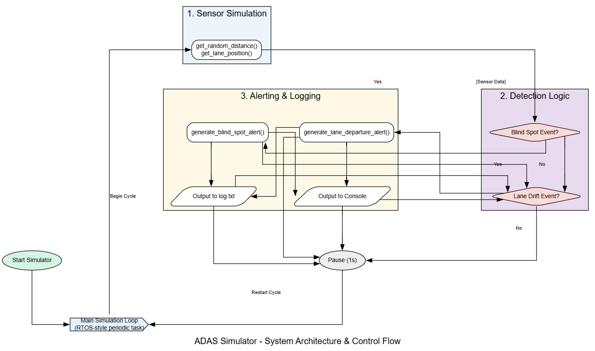

# 🚗 ADAS Core Logic Simulator

A hardware-independent simulator for an Advanced Driver Assistance System (ADAS), written entirely in C. It models the core logic for two critical automotive safety features: **Blind Spot Detection (BSD)** and **Lane Departure Warning (LDW)**.

---

## 📚 Table of Contents

- [Project Overview](#project-overview)
- [System Architecture](#system-architecture)
  - [Design Philosophy](#design-philosophy)
  - [Data Flow](#data-flow)
  - [Module Descriptions](#module-descriptions)
- [Key Features](#key-features)
- [Code Documentation](#code-documentation)
- [Build and Execute](#build-and-execute)
  - [Prerequisites](#prerequisites)
  - [Using Makefile (Recommended)](#using-makefile-recommended)
  - [Manual Compilation](#manual-compilation)
- [Example Simulation Output](#example-simulation-output)
  - [Terminal Output](#terminal-output)
  - [Log File Output](#log-file-output)
- [License](#license)
- [Credits](#credits)

---

## Project Overview

This ADAS simulator is a real-time logic emulator that mimics radar and lane tracking behavior using only software logic. Designed to reflect embedded software engineering practices, it demonstrates clean modular architecture, RTOS-like task separation, and time-sensitive event handling without requiring any physical hardware.

---

## System Architecture

### Design Philosophy

The simulator is built using a modular, decoupled architecture. Each subsystem (sensing, logic, alerting, logging) is implemented as a standalone C module with a corresponding `.h` interface.

**Benefits:**
- **Portability** – Easy to port to microcontroller firmware.
- **Testability** – Each module can be unit-tested.
- **Scalability** – Add new ADAS features easily.
- **Maintainability** – Logical separation simplifies debugging and extension.

### Data Flow

<p align="center">
  
  <br/>
  <em>ADAS Core Logic Flow — BSD and LDW Simulation Pipeline</em>
</p>

---

### Module Descriptions

| Module             | Responsibility                                                                      | Files                         |
|--------------------|--------------------------------------------------------------------------------------|-------------------------------|
| `main`             | Initializes and runs the simulation loop                                             | `main.c`                      |
| `sensor_simulation`| Generates fake radar and camera data                                                 | `sensor_simulation.c/h`       |
| `blind_spot`       | Evaluates distances to detect objects in blind zones                                 | `blind_spot.c/h`              |
| `lane_detection`   | Detects drift from the center lane                                                   | `lane_detection.c/h`          |
| `alert`            | Formats and displays alerts in real-time                                             | `alert.c/h`                   |
| `log`              | Records events with timestamps into `log.txt`                                        | `log.c/h`                     |
| `terminal_colors`  | Adds colored output using ANSI escape sequences                                      | `terminal_colors.h`           |

---

## Key Features

- **Intelligent Sensor Simulation** – Mimics radar and lane camera behavior using controlled randomness.
- **Blind Spot Detection** – Detects nearby objects < 100 cm on left/right sensors.
- **Lane Drift Detection** – Detects deviation from center and issues drift alerts.
- **Real-Time Console Alerts** – Outputs clean, readable alerts with status lines.
- **Persistent Logging** – Records all alerts with timestamps in `log.txt`.

---

## Code Documentation

All public header files (`*.h`) are documented using Doxygen-style comments, including function purpose, input/output, and usage hints.

---

## Build and Execute

### Prerequisites

- GCC or compatible C compiler
- `make` (optional but recommended)

### Using Makefile (Recommended)

```bash
make
````

### Manual Compilation

#### Linux/macOS:

```bash
gcc main.c sensor_simulation.c blind_spot.c lane_detection.c alert.c log.c -o adas
```

#### Windows (MinGW):

```bash
gcc main.c sensor_simulation.c blind_spot.c lane_detection.c alert.c log.c -o adas.exe
```

### Running the Simulator

#### Linux/macOS:

```bash
./adas
```

#### Windows:

```bash
.\adas.exe
```

Press `Ctrl+C` to stop the simulation loop.

---

## Example Simulation Output

### Terminal Output

```
[OK] Lane: CENTER       | Left: 185 cm | Right: 130 cm
[OK] Lane: CENTER       | Left: 120 cm | Right:  80 cm
[!!] Blind Spot Alert: Object on RIGHT, Distance = 80cm
[OK] Lane: RIGHT_DRIFT  | Left: 155 cm | Right: 195 cm
[!!] Lane Drift Alert: Drifting RIGHT
```

### Log File Output

```
--- ADAS Log Session Started at 19:30:11 ---
[19:31:29] Blind Spot Alert: Object on LEFT, Distance = 54cm
[19:31:29] Lane Drift Alert: Drifting RIGHT
[19:31:30] Blind Spot Alert: Object on LEFT, Distance = 51cm
```

---

## License

This project is licensed under the [MIT License](https://choosealicense.com/licenses/mit/).

---
## Credits

👨‍💻 **Author**: Akshay Tiwari  
📧 **Email**: [tiwariakshay590@gmail.com](mailto:tiwariakshay590@gmail.com)  
🌐 **GitHub**: [https://github.com/AkshayTiwari27](https://github.com/AkshayTiwari27)  
🔗 **LinkedIn**: [https://www.linkedin.com/in/akshay-tiwari2709/](https://www.linkedin.com/in/akshay-tiwari2709/)  

